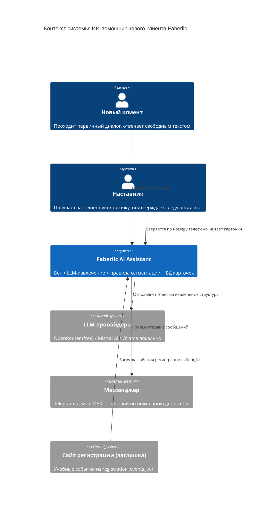
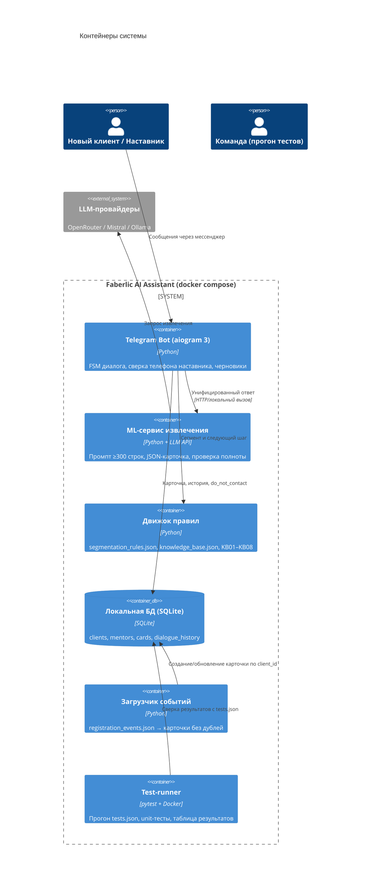
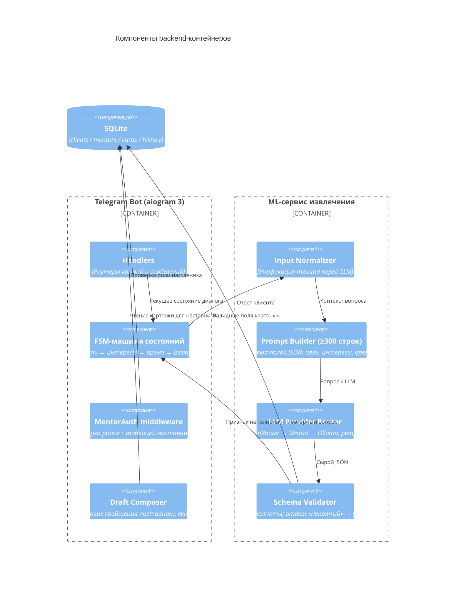

# C4 Architecture — Faberlic AI Assistant (FB01)

Диаграммы в Mermaid (рендерятся на GitHub/GitVerse встроенно). PNG-экспорт можно получить через `mermaid-cli` в папку `docs/generated/`.

## 1. Level 1 — System Context

Границы: система не выполняет реальные регистрации, платежи и рассылки; все сообщения наставника — черновики с ручным подтверждением (`requires_human_approval = true`).

## 2. Level 2 — Containers

## 3. Level 3 — Components (Telegram Bot + ML-сервис)

## 4. Ключевые потоки

**Первичный диалог (F002):** загрузка события → FSM задаёт вопрос → ответ «Ищу дополнительный доход…» → нормализация → LLM-извлечение → валидация → сегмент `income` + цитата → `next_action` «вводная беседа с наставником» → карточка в БД.

**Доступ наставника:** входящее сообщение → сверка телефона с `mentors` → выдача карточки клиента (список `client_id`, полные поля, история) → любой ответ клиенту остаётся черновиком.

**Отказ (F006):** «Не пишите мне больше» → `do_not_contact = true` → диалог остановлен, следующий шаг не предлагается, повторная загрузка события отказ не снимает.
